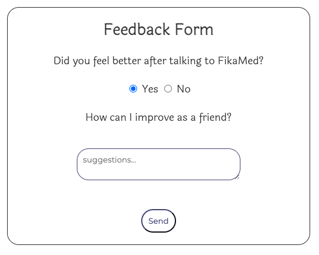

# **FikaMed** 
[FikaMed](https://mervekucukzoroglu.github.io/FikaMed/) is a digital friend chat bot for immediate support to mental health patients. This platform provides users to understand what they feel and what they can do to calm down and feel better eventually. FikaMed approaches users friendly and addresses them with their names after the users enters their name. The control is in the hands of user and they decide the next step of FikaMed, based on which button they click. The last stage always has a feedback form as well.

FikaMed also has a timer, starts when user clicks on it, to do meditation for one minute. If they feel so, they could repeat this stage as many times as the user wants. This timer is displayed if the user tells FikaMed that they feel angry. 

This platform wishes to be an immediate support to deal with one's emotions. However, if the user needs a medical support they should consult a professional doctor.

# Features
## Existing Features
* Header
    * The header displays the logo and the name of the page. 
    * 'Fika' is a word used in Sweden which means a coffe break with a friend. 'Med' is a short word for 'Medical'; and 'med' also means 'together' in Swedish language. This forms the name *FikaMed*.
    * The chatbox and a smiley within the logo delivers the understanding of friendly talk with the user.

        

* Introduction 
    * In the initial page, FikaMed introduces itself as it is a digitial friend and asks the user to enter a name to begin the talk journey. 
    * There will be an alert if a name or a nickname is not entered. To address the user by the name they enter, this is a must stage to be completed at the begining. 

        
* Feeling-Today
    * This is the immediate next stage, asking the user how they feel today. At this stage the user will decide what to see next with the 2 options: 
        * Awesome 
        * Terrible

        
    
* Feeling Awesome 
    * When the user clicks the 'awesome button', the conversation will have a follow-up question as to what makes them feel awesome. 
    * The options provided are radio buttons and options are as follows:
        1. School / Work
        2. Family / Friends 
        3. Nature / Hobbies
        4. Health / Myself
        5. FikaMed

        

* Complete
    * When the user chooses the reason of their motivation, they will move on to the 'complete stage'. 
    * This is the stage just before the feedback form stage. This stage will be reached by both the ways user chooses at the beginning 'awesom' or 'terrible'. It gives the user a small advice and a motivation. 

        

* Feedback
    * The feedback form is a voluntary form. It is the final stage from either 'awesome' or 'terrible' options. 
    * With a yes/no radio options, asks the user how they felt after talking to FikaMed. 
    * It has a section to send a message or a suggestion for any improvements by the user.
    * When clicked the send button, the page will refresh and be directed to the first stage of introduction.

        

* Feeling Terrible 
    * If the user decides to click the option 'Terrible' at the 'Feeling Today' stage, they will be at feeling terrible stage. 
    * At first FikaMed indicates that they are friends and further asks the user what they feel with 4 options: 
        * Angry
        * Sad
        * Tired
        * Worthless 

        

* Feeling Angry
    * First, FikaMed asks the user to do some Inhale and Exhale exercise for a minute.
    * There is a timer that starts once its clicked. It is a one minute timer, counting backwards. When the timer starts, the counting is displayed below it. Once its over, it says to click it again to repeat the exercise. This gives freedom to user to repeat as many times as they want.
    * The user can skip this stage if they wish to, and follow up the next tips on what they can do to calm down. 
    * FikaMed tells the user to come again and say how they feel later. 
    * The 'Okay' button at the end will direct the user to the next stage.

        

    * After the user clicks 'Okay' button, the user will be directed to 'Complete' stage and then to 'Feedback Form' from there. _(this two stages are explained above)_

* Feeling Sad
    * FikaMed gives a motivational response to the user.
    * Provides with some advices on what they can do to feel better. 
    * FikaMed tells the user to come again and say how they feel later. 
    * The 'Okay' button at the end will direct the user to the next stage.

        

    * After the user clicks 'Okay' button, the user will be directed to 'Complete' stage and then to 'Feedback Form' from there. _(this two stages are explained above)_

* Feeling Tired
    * FikaMed gives a motivational response to the user.
    * Provides with some advices on what they can do to feel better. 
    * FikaMed tells the user to come again and say how they feel later. 
    * The 'Okay' button at the end will direct the user to the next stage.

        
        
    * After the user clicks 'Okay' button, the user will be directed to 'Complete' stage and then to 'Feedback Form' from there. _(this two stages are explained above)_
    
* Feeling Worthless
    * FikaMed gives a motivational response to the user.
    * Provides with some advices on what they can do to feel better. 
    * FikaMed tells the user to come again and say how they feel later. 
    * The 'Okay' button at the end will direct the user to the next stage.

        
        
    * After the user clicks 'Okay' button, the user will be directed to 'Complete' stage and then to 'Feedback Form' from there. _(this two stages are explained above)_

* Notice 
    * There is a notice display always on the page , at the bottom. 
    * It notifies the user to know that FikaMed is just a digital friend, and that they must consult a professional doctor if they need medical support.  

        